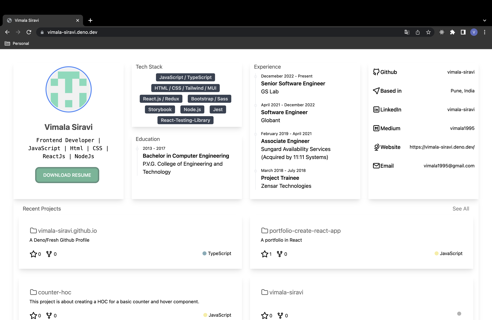

### [DEMO Link](https://vimala-siravi.deno.dev/)

Create your live auto-update portfolio by fetching latest information from
github.

### Steps to Create your own

1. Fork this repo.
2. Update [profile.json](./profile.json) to have your information.
3. Replace [Vimala_Siravi_FrontEnd_Developer.pdf](./static/Vimala_Siravi_FrontEnd_Developer.pdf) with your resume file.
4. `deno task start` to check your profile.
5. Deploy it to your favorite deployment server.
